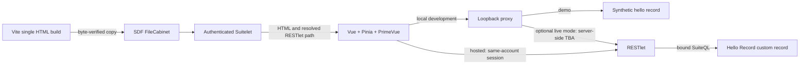
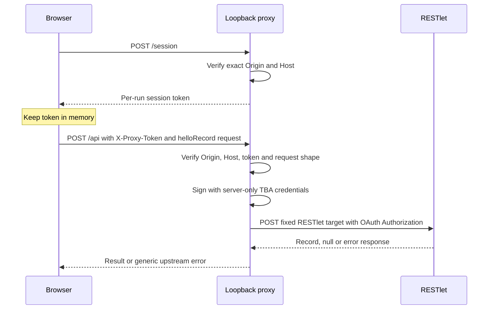

# NetSuite Vue SPA

Build a Vue application that lives inside NetSuite: a small, read-only Hello Record example with Vue 3, TypeScript, Pinia, PrimeVue, a SuiteScript 2.1 RESTlet and a hosting Suitelet.

For NetSuite developers who want a working starting point, a local demo without an account, and explicit boundaries between browser code, development credentials and SDF deployment.


[Quickstart](#try-it-in-five-minutes) · [Architecture](#how-it-fits-together) · [Customize](#make-it-yours) · [Security](#security-model) · [Sandbox](#move-to-a-sandbox) · [Deployment scope](#deployment-scope) · [Troubleshooting](#troubleshooting) · [Docs](docs/README.md) · [Credits](#credits)

## Try it in five minutes

Use **Node.js 22.12+** (Node 22 LTS is the tested baseline) and npm. Download or clone this repository, then run these commands from its root:

```bash
npm run setup
cp apps/vite-spa/.env.example apps/vite-spa/.env
npm run dev
```

Open **http://127.0.0.1:5173**, keep the name “Hello world”, and click **Find hello record**. Demo mode returns a synthetic record with ID `1`; it does not call NetSuite. The example environment file contains invented account and credential values. Dependencies need an internet connection to install; the demo and checks need no NetSuite account.

Use the exact `127.0.0.1` URL. The proxy rejects a different or missing Origin. Stop both servers with Ctrl+C.

```bash
npm run check
```

This typechecks and builds the frontend, byte-verifies its copy into SDF, runs Vitest and Jest, and checks SDF XML, file references and generated JavaScript syntax. It does **not** authenticate, validate against an account or deploy.

## How it fits together



| Path | What lives there |
|---|---|
| `apps/vite-spa/src/` | Vue page, Pinia store and scoped styles |
| `apps/vite-spa/plugins/netsuite-api.ts` | Typed client with runtime response validation |
| `apps/vite-spa/server/` | Development-only caller checks and HMAC-SHA256 TBA signing |
| `apps/netsuite/_templates/` | Source templates for two scripts and three SDF objects |
| `apps/netsuite/src/` | Generated SDF project; built HTML is ignored by Git |
| `scripts/generate.mjs` | Validated template substitution and overwrite protection |
| `.agents/skills/` | Fourteen portable NetSuite skills with provenance and licenses |

The example supports only `helloRecord`. It performs an exact-name lookup of one active custom record. An account with no matching record returns `null`. There are no payment, transaction mutation, cache-clear, scheduled-worker or background-progress endpoints.

## Make it yours

Edit [template.config.json](template.config.json). The [variable reference](apps/netsuite/_templates/TEMPLATE_VARIABLES.md) explains allowed values and substitutions.

```bash
# Preview a fresh SDF output without overwriting existing files:
npm run generate -- --output ./generated-example
# Regenerate the owned files under apps/netsuite/src:
npm run generate -- --force
npm run check
```

Generation refuses invalid identifiers and existing files unless `--force` is explicit. When changing the folder or prefix, remove the **old generated example subtree and objects** after reviewing them; the generator does not delete unrelated files. The build reads `projectFolder` and copies into that folder. In NetSuite, the Suitelet resolves the generated RESTlet IDs at runtime. For optional live local development, update the public RESTlet path in `.env` to those IDs.

## Security model

> [!WARNING]
> Never put secrets in `VITE_` variables: that prefix is public browser configuration. Only `VITE_RESTLET_URL` and `VITE_API_SERVER_PORT` are allowed.

- **Browser:** only `VITE_RESTLET_URL` and `VITE_API_SERVER_PORT` are allowed. They are public routing metadata. Other `VITE_` keys fail configuration validation; never put secrets under that prefix. No tokens are stored in localStorage.
- **Development proxy:** binds `127.0.0.1`, verifies exact Origin and Host, requires a per-run session token for `/api`, bounds JSON to 8 KB and upstream requests to 10 seconds, rejects redirects, and allows only the read-only task. The token stays in browser memory. This protects against other browser origins and network clients; it does not isolate the proxy from trusted or malicious processes running as the local user.
- **TBA:** `TBA_*` credentials are read only by the Node development server in `NETSUITE_MODE=live`. The production bundle does not include the proxy or credentials. The default is `demo`; changing to `live` requires replacing the placeholders and matching the account hostname to its realm.
- **NetSuite:** authenticated Suitelet, current-role execution, permission-list custom record access, bound query values, and generic error responses. Logs contain only a generated reference and error code. Script deployments start in `TESTING`, with no universal audience or Administrator run-as role.

The first request in optional **live local development** follows this path:



Use a dedicated least-privilege sandbox role. Configure record permissions and deployment audience for your account; do not solve permission failures by expanding the role indiscriminately.

## Move to a sandbox

> [!IMPORTANT]
> The owner performs account setup and sandbox validation separately. The account-free check does not authenticate, validate against an account or deploy.

The [SDF deployment guide](apps/netsuite/docs/DEPLOYMENT.md) lists the prerequisites, exact script/object inventory, testing audience, record fixture and verification steps. `suitecloud project:validate` requires an account context in the tested CLI, even for its local mode; it is not part of this repository's account-free check.

Start with the [SDF project README](apps/netsuite/README.md), [architecture](apps/netsuite/docs/ARCHITECTURE.md), [API contract](apps/netsuite/docs/API.md), and [guided code walkthrough](apps/netsuite/docs/LEARNING.md). The [skill application map](docs/SKILLS.md) shows how the included NetSuite guidance applies to this template.

## Deployment scope

This template provides an account-free demo and checks, plus instructions for owner-run sandbox validation. Account setup, account validation and deployment are separate owner actions. Before production use, adopters must supply an account-specific rollout and approval plan, rollback and recovery procedure, dependency and generated-code upgrade process, and monitoring with operational verification and incident ownership. Sandbox success alone does not establish production readiness.

## Troubleshooting

| Symptom | What to check |
|---|---|
| Proxy returns 403 | Open `http://127.0.0.1:5173`; verify matching proxy port; reload after restarting the proxy to obtain a new session |
| Unsupported browser environment variable | Remove unrecognized `VITE_` keys from shell and Vite environment files; move credentials to server-only names |
| No matching record in NetSuite | Create the synthetic record described in the deployment guide and check the role's View permission |
| SDF artifact missing | Run `npm run build` before tests or structural validation |
| Generation refuses overwrite | Use a fresh `--output` folder or review the source before using `--force` |

## Credits

Derived from [Bibek Shrestha's NetSuite Vue/Vite SPA](https://github.com/BibekStha/netsuite-vue-vite-spa/tree/4fe7a9a010d8f9b8ff405b0c5c9139821ddecefa), pinned to that commit. The original MIT notice is retained in [apps/vite-spa/LICENSE](apps/vite-spa/LICENSE). This is an independently maintained derivative; no GitHub fork relationship is implied.

See [Changes from upstream](docs/CHANGES-FROM-UPSTREAM.md) for the verified file inventory, replacements, additions and licensing details.

Project code and the six public house-skill editions use the [MIT license](LICENSE). The eight Oracle NetSuite skills retain **UPL 1.0** licenses and pinned provenance. [Third-party notices](THIRD_PARTY_NOTICES.md) include the upstream MIT notice and the historical CryptoJS v3.1.2 notice. The current signer uses Node's built-in crypto; CryptoJS is no longer bundled.
