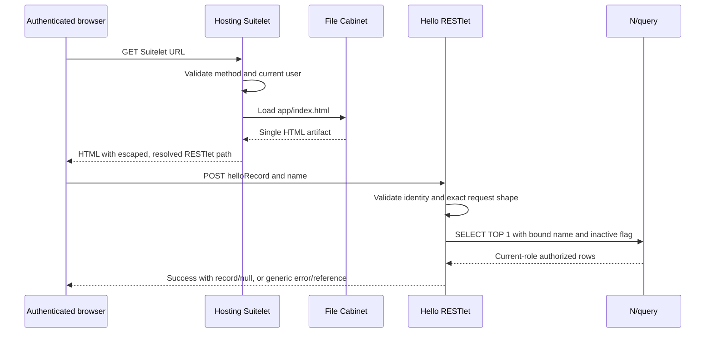
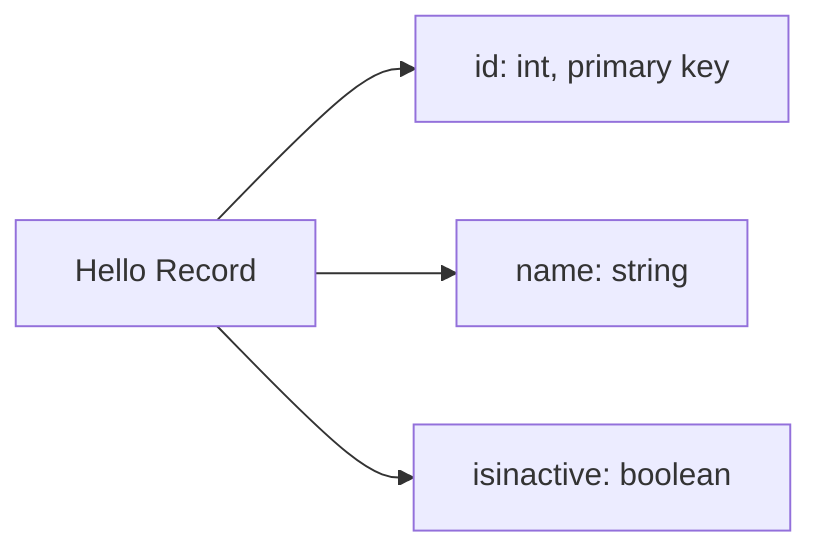

# Architecture

Static analysis · 2026-09-08

The Vue entrypoint installs Pinia and PrimeVue, creates a typed API client and mounts under `#nvs-app`. The Pinia store holds loading, error and result state. Requests replaced or cancelled by the component cannot overwrite a newer result.

In local demo mode, the client opens a session with the Node proxy, then sends the same request contract with an ephemeral token. The proxy verifies Origin/Host, validates the task and returns a synthetic row without signing or making network calls. Optional live mode signs the fixed RESTlet target using Node HMAC-SHA256. Neither the Node proxy nor its credentials is part of the SDF artifact.

There is no persistent browser cache, background worker, mutation queue or server-side cache. A query error is an error, not an empty result. The active role controls record access; query metadata errors are not hidden by a permissive provider.

`name` is the enabled built-in record name, not a custom field. This schema belongs to this project's custom record XML; the standard Records Browser is supplemental reference, not proof of an account's custom schema.
